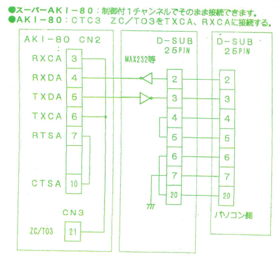
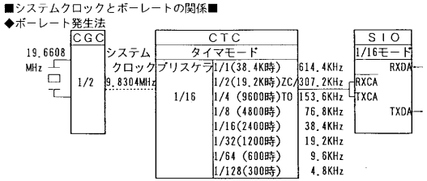
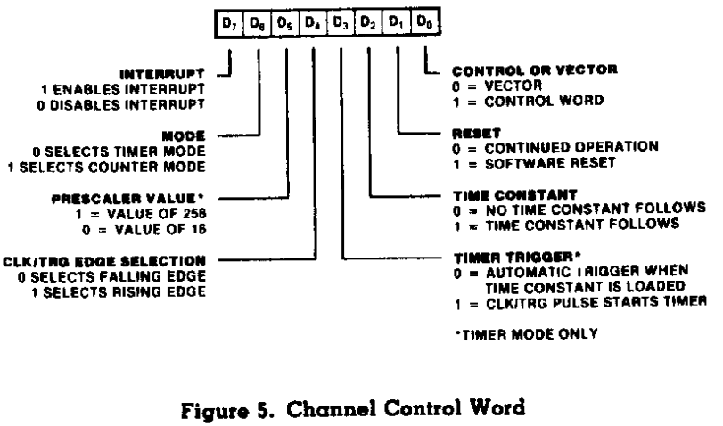
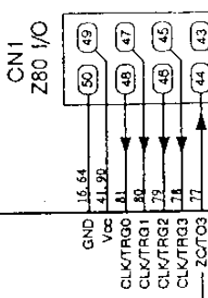
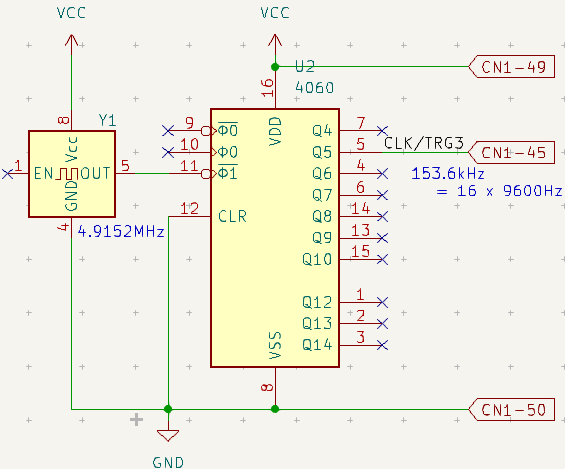

# シリアルクロック分離

秋月モニタROM を用いる時、以下の想定でシリアル通信が可能となっている。

- SIOA で通信
  - 9600bps Non-parity 8bit 1stopbit
- システムクロック 19.6608 MHz
  - CPUクロック 9.8304 MHz
- CTC3 出力(ZC/TO3) に TXCA, RXCA を接続
  - SuperAKI80 ではボード内で接続済
  - AKI80 Gold/Silver では未接続だが、ROMの説明書で接続せよとなっている
    - 

## シリアルクロック決定の流れ



[SuperAKI80 のドキュメント](../../datasheets/A003_SuperAKI-80.pdf) から詳細を確認する。\
各設定値は秋月モニタROMから拾っている(UniversalMonitorのデフォルト値も同じ)

1. システムクロック 19.6608MHz とする
2. CGC(Clock Generator/Controller)で 1/2 → 19.608MHz / 2 = 9.8304MHz
   1. CPU クロックとして供給
   2. CTC, SIO, PIO, WDTにも動作クロックとして供給
      1. SIO の通信で使用するクロックはこれではない
3. CTC3 の設定
   1. タイマモード(動作クロックのカウントをする)
   2. プリスケーラ 1/16 → 9.8304MHz / 16 = 614.4kHz
   3. カウント値4 → 614.4KHz / 4 = 153.6kHz → これが ZC/TO3 から出力される
4. SIOA の設定
   1. (TXCA,RXCA は ZC/TO3 に接続)
      1. SIO はこの入力クロックを基準に動作する
   2. WR4 値 = 44h
      1. 16倍クロックモード → 153.6KHz / 16 = 9600 Hz → 9600bps が確定
         1. (x1/x16/x32/x64 が設定できるが一般に x1 は使用しない)
      2. Non-Parity 8bit 1stopbit

以上のように、秋月モニタROMは 19.6608MHz 搭載時に 9600bps となるよう設定されている。\
ROM のため値が変更できないので、システムクロックを半分の 9.8304MHz にするなら 4800bps、4.9152MHz なら 2400bps になってしまう。\
また、Universal Monitorなどなら設定変更はできても SIO の都合でやはり「システムクロックがシリアルクロックの逓倍」からは逃れられない。

つまり、このままでは任意のシステムクロックで動作させたい場合にシリアル通信に不都合が生じる。

## CTC の設定

CPU のクロックを任意に変更しつつ、シリアル通信を 9600bps を保つ方法を検討したい。

まず UniversalMonitor のコードを元に、Z80SIO 側設定は変更しない前提とする。
- SIOA
  - WR4 値 = 44h
    - 16倍クロックモード
  - Non-Parity 8bit 1stopbit

その上で手段として、

- 任意のクロックからシリアルクロックの逓倍を作る
  - PLL等がなく難しい
- 外部供給のクロックを使う
  - これはできそう

以上から CTC3 を外部供給動作の「カウンターモード」に変更する方向で検討する。


[データシート](../../datasheets/Z80CTC-z8430.pdf)を参照する。


元の設定値は、0x07。
- D7=0
  - 割込み未使用
- D6=0
  - タイマーモード
- D5=0
  - プリスケーラ 1/16
- D4=0
  - 立ち下がりエッジを使用
- D3=0
  - 定数値ロード時からトリガ
- D2=1
  - 定数値ロード
- D1=1
  - S/W リセット
- D0=1
  - 定数設定(続く2バイト目の書き込みの内容を指定している)

ここから D6 = 1 として「カウンターモード」を選択すればよい。

しかし、カウンターモードには条件がつく
- D5のプリスケーラが無視される
- D3のロード時トリガが無視される
- カウントタイミングがシステムクロックに同期する
  - → 極端に高い周波数のパルスは適切に処理できない可能性がある

そのため、タイマーモードが使うシステムクロックに比べ「低めのクロックを外部から供給する」のが安全となる。

方針として
- シリアルクロックを外部から供給する
  - シリアルクロックの逓倍
  - システムクロックに比して低め
- 最終的に TXCA/RXCA に 153.6kHz を入力する
  - ZC/TO3 から 153.6kHz が出力されてほしい
  - CLK/TRG3 に入力する周波数は 153.6kHz の 1〜8倍程度？がよさそう

## 回路検討

ここでは以下のようにした。

- 4.9152MHz の水晶発振器を使用
- 適当に分周して CLK/TRG3 に入力
  - 7474、4020、4040、4060、などのカウンタ IC で適宜作る
  - そのまま TXCA/RXCA に入力してもよいが、SuperAKI80ではすでにパターン接続されているためパターンカットを避けて CTC3 に入力する

CTCまわりの入出力は CN1 に引き出されている。



4.9152MHz の 水晶発振器から(たまたま手元にあった)4060 で 32 分周した。

4915.2 (kHz) / 32 = 153.6(kHz)

そのまま Z80SIO へ 153.6kHz を渡せばよいので、CTC3の定数値には「1」を指定する。



## Universal Monitor 修正

- まず CTC3 の設定を変えられるよう修正
  - 【参考】[UniversalMonitor](../../universalmonitor/README.md)
  - カウンターモード(CLK/TRG3から入力)
  - CTC3 での分周値を設定
    - ここでは分周しないので1

USE_Z80CTC3EXT = 1 にしたものを config.superaki80ext として保存。

```diff
--- a/unimon/z80/config/config.superaki80
+++ b/unimon/z80/config/config.superaki80
@@ -143,6 +143,12 @@ CTC0:      EQU     10H
 CTC1:  EQU     11H
 CTC2:  EQU     12H
 CTC3:  EQU     13H
+USE_Z80CTC3EXT = 0
+       IF USE_Z80CTC3EXT
+CTC_V: EQU 71          ; Counter mode, fall-edge, ext trigger
+TC_V:  EQU     1               ; pass to TXCA/RXCA
+       ELSE
+CTC_V: EQU 7           ; Timer mode, 1/16, fall-edge, no ext trigger
 TC_V:  EQU     4               ; 9600bps @ 9.8304MHz
+       ENDIF
        ENDIF                   ; USE_Z80CTC
        ENDIF
```

分周値設定を反映するよう修正
```diff
--- a/unimon/z80/dev/dev_z80sio_ctc3.asm
+++ b/unimon/z80/dev/dev_z80sio_ctc3.asm
@@ -19,7 +19,7 @@ INIT:
        ENDIF                   ; USE_CTC
 
        IF USE_Z80CTC3
-       LD      A,07H           ; Timer mode, 1/16, fall-edge, no ext trigger
+       LD      A,CTC_V
        OUT     (CTC3),A
        LD      A,TC_V
        OUT     (CTC3),A
```

##  動作確認

- SuperAKI80 のクロックは 3.579545MHz
  - 搭載した水晶発振子は 7.15909MHz
  - (下記シリアル用クロック周波数の整数数ではない)
- 外部入力クロック 4.91525MHz / 32 = 153.6KHz
  - CTC3 で 1 分周(=分周しない)
  - SIOA で 16 分周 → 9600bps

```
$ minicom -D /dev/ttyUSB0 -b 9600

minicom へようこそ 2.9

オプション: I18n 
ポート /dev/ttyUSB0, 12:53:33

CTRL-A Z を押すと、説明画面になります。

Universal Monitor Z80
Z80
8000-FFFF
] 

```
(以上)