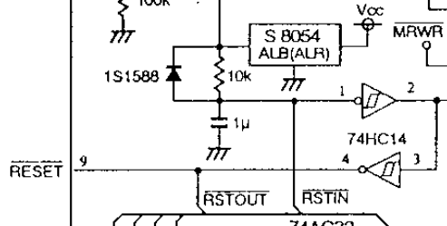
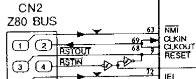
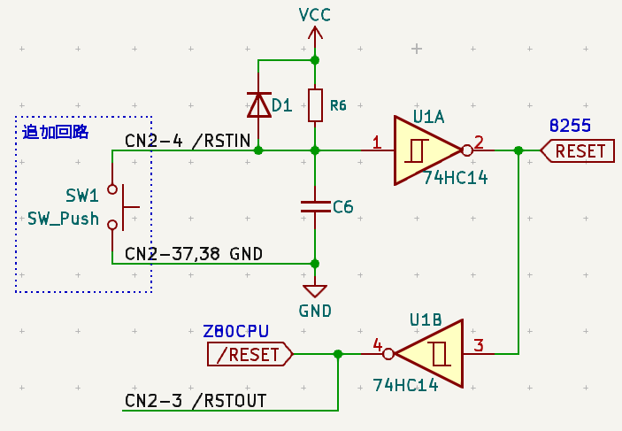

# リセットボタンの追加

[最小限セットアップ](../../setup/README.md) の回路ではパワーオンリセット以外のリセットがかからず使いにくいのでリセットボタンを追加する。

## 検討
リセット周りの回路図は以下

- リセット入力信号線として /RSTIN がある。負論理。
  - リセットIC(電源監視IC) S8054 ALBは省略、VCC直結。
  - リセット入力は インバータを 2 回通って Z80 CPU のリセットへ
    - 8255のリセットもここで生成している
- リセットするには /RSTIN を High → Low → High にすればよい
  - R6 がプルアップとして機能
  - 74HC14 はシュミットトリガインバータ
    - 加えて C6 がチャタリング防止のローパスフィルタとして機能
  - → プッシュボタンだけ追加すれば良さそう

- CN2に必要な信号線は引き出されている

## 回路図
以下のようにボタンを1個追加するとリセットボタンとして機能する。

(以上)