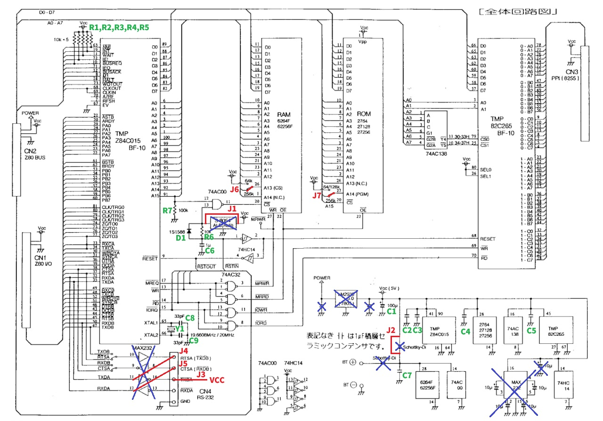
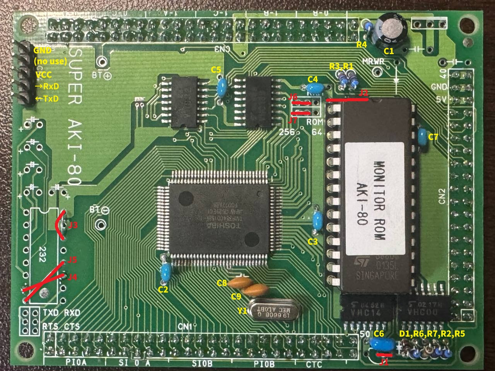

# SuperAKI80 の最小限セットアップ
秋月から購入した SuperAKI80 を最低限度の部品と回路変更で動作させる。

今回は X.com 等から収集した情報をまとめた。

## 概要

- システムクロック
  - 9.8304MHz 動作
- IPL
  - 秋月公式モニターROM
- 電源
  - PC とのシリアル接続から +5V 供給を想定
  - PC と接続しない場合は CN1〜3 などから +5V を供給すること
- リセットボタンは外付
- シリアル接続
  - 9600bps Non-parity 8 bit 1 stopbit (9600N81)
  - フロー制御なし
  - [CH340E変換モジュール](https://akizukidenshi.com/catalog/g/g114745/)の接続を想定

### 参考
- [@yyhayamiさん](https://x.com/yyhayami)の[ツイート](https://x.com/yyhayami/status/1924987076833116465?s=52)
  - この情報を元にいくつか修正済

## 回路変更



### 部品表
[SuperAKI80 ドキュメント](../datasheets/A003_SuperAKI-80.pdf)に基づいた部品表とその修正
- 抵抗値はオーダーがあっていれば概ね問題なし
- C8,C9 はなくても動きそうだが安定しないかも

|#|Parts|Qty|参考|
|-|-----|---|-----|
||Z84C015BF-10/-12|搭載済|Z80CPU/CTC/SIO/PIO|
||ADM232AAN|不要|EIA232レベル変換|
||S8054ALB|不要|リセットIC|
||NJM2930-5|不要|+5Vレギュレータ|
||11EQS04|不要|BATT用ショットキDi|
|D1|1S1588|1|パワーオンリセット用Di([1N4148](https://akizukidenshi.com/catalog/g/g100941/)で代用可)|
|C1|100uF|1|[アルミ電解コンデンサー100μF16V105℃ ルビコンMH5](https://akizukidenshi.com/catalog/g/g105002/)(22uF〜くらいでもOK)|
|C2,C3,C4,C5,C6,C7|0.1uF|6|[積層セラミックコンデンサー 0.1μF50V X7R 2.54mm](https://akizukidenshi.com/catalog/g/g113582/)|
||1uF|不要|EIA232レベル変換のチャージポンプ用コンデンサ|
|R1,R2,R3,R4,R5,R6|10k ohm|6|[カーボン抵抗(炭素皮膜抵抗) 1/6W10kΩ](https://akizukidenshi.com/catalog/g/g116103/)|
|R7|100k ohm|1|[カーボン抵抗(炭素皮膜抵抗) 1/6W100kΩ](https://akizukidenshi.com/catalog/g/g116104/)|
|Y1|19.6608MHz Xtal|1|[クリスタル(水晶発振子) 19.6608MHz](https://akizukidenshi.com/catalog/g/g108672/)|
||28pin socket|1|[丸ピンICソケット (28P) 600mil(桟なし)](https://akizukidenshi.com/catalog/g/g106740/)(必要なら)|
||3.6V Li BATT|不要||
|C8,C9|33pF|2|[セラミックコンデンサー 33pF50V](https://akizukidenshi.com/catalog/g/g116521/)|
||27C256|1|[AKI80(Z80)モニターROM](https://akizukidenshi.com/catalog/g/g117738/)|
||5pin header|1|シリアル接続用|
||ジャンパ線|5||

## 動作確認

- ホスト PC
  - Ubuntu 24.04 LTS
  - シリアル接続 CH340Eシリアル変換モジュール
    - 9600bps N81 フロー制御なし
- SuperAKI80 ボード
  - 秋月 モニターROM


ここではシリアル端末に minicom を使う

```bash
$ minicom -D /dev/ttyUSB0 -b 9600
```

秋月モニタROM は起動すると [Z-VISION remote](https://www.vector.co.jp/soft/win95/prog/se057095.html?srsltid=AfmBOopQD9D208BWd_7I7VOycXnOAcZCp0OIveNCRfVlbOQP-Cmd37LA)/[Windows](https://www.vector.co.jp/soft/win95/prog/se057095.html?srsltid=AfmBOopQD9D208BWd_7I7VOycXnOAcZCp0OIveNCRfVlbOQP-Cmd37LA) の接続待ちとなるが過去の解析結果からそのままでもいくつか利用方法がある。

### 秋月モニタROM 内蔵 TINY BASIC

接続したら (本来は'@' が表示されるがそのまま) ENTER キーを押すと TinyBASIC が起動する。

```text
Start Z80 remote basic Ver.1.0 made by System Load
                                ..since 1992. 
ok
>
```

秋月モニタROMのTiny BASIC は以下の点に注意
- 改行は CR+LF
  - Ctrl+J で送信可能
- 浮動小数点に対応していない
- その他一般にいう BASIC と相違点多数

サンプルとして ASCIIART を実行してみる
- [@DragonBallEZさん](https://x.com/DragonBallEZ)の[ツイート](https://x.com/dragonballez/status/1920866005502382565?s=52)
  - [プログラム](./asciiart-tiny-crlf.bas)(行末コード CRLF 化済)
  - 

送出には minicom の転送機能を使ってもよいが別コンソールからcat等で転送してもよい。ただし、フロー制御がないので送出は間隔をあけるよう「ゆっくり」行う。
```bash
$ ./slowtransfer.sh ./asciiart-tiny-crlf.bas /dev/ttyUSB0
```
実行結果
```text
>list
    10 F=50
    20 Y=-12
    30 X=-39
    40 C=X*229/100
    50 D=Y*416/100
    60 A=C
    70 B=D
    80 I=0
    90 Q=B/F
   100 S=B-Q*F
   110 T=(A*A-B*B)/F+C
   120 B=2*(A*Q+A*S/F)+D
   130 A=T
   140 P=A/F
   150 Q=B/F
   160 Z=0
   170 IF (P*P+Q*Q)<5 GOTO 360
   180 IF I=0 PRINT "0",
   190 IF I=1 PRINT "1",
   200 IF I=2 PRINT "2",
   210 IF I=3 PRINT "3",
   220 IF I=4 PRINT "4",
   230 IF I=5 PRINT "5",
   240 IF I=6 PRINT "6",
   250 IF I=7 PRINT "7",
   260 IF I=8 PRINT "8",
   270 IF I=9 PRINT "9",
   280 IF I=10 PRINT "A",
   290 IF I=11 PRINT "B",
   300 IF I=12 PRINT "C",
   310 IF I=13 PRINT "D",
   320 IF I=14 PRINT "E",
   330 IF I=15 PRINT "F",
   340 Z=-1
   350 GOTO 410
   360 I=I+1
   370 IF I<16 GOTO 410
   380 PRINT " ",
   390 Z=-1
   410 IF Z=0 GOTO 90
   420 X=X+1
   430 IF X<=39 GOTO 40
   440 PRINT
   450 Y=Y+1
   460 IF Y<=12 GOTO 30
ok
>run
111111111111111111222222222333334568BC67443322222211111111111000000000000000000
11111111111111111122222222233344598C  77943333222221111111110000000000000000000
111111111111112222222233324444556       955433332211111111100000000000000000000
111111111211112222222333455665778       976554444222211111100000000000000000000
11111112222222233333334457 AB9              787B5432111111111100000000000000000
11112222222222333333444667                       532222111111111000000000000000
11111222333444444444555A                       96443322211111110000000000000000
12222223345D6657 6555679                        AA43322211111110000000000000000
222233334569  8C  E8789                          B43322111111110000000000000000
223333345578D        E                            43322211111111111100000000000
3344444789A                                      543322111111111111100000000000
5555658A                                       C6433222222111111111100000000000
                                              975443322221111111111100000000000
5555658A                                       C6433222222111111111100000000000
3344444789A                                      543322111111111111100000000000
223333345578D        E                            43322211111111111100000000000
222233334569  8C  E8789                          B43322111111110000000000000000
12222223345D6657 6555679                        AA43322211111110000000000000000
11111222333444444444555A                       96443322211111110000000000000000
11112222222222333333444667                       532222111111111000000000000000
11111112222222233333334457 AB9              787B5432111111111100000000000000000
111111111211112222222333455665778       976554444222211111100000000000000000000
111111111111112222222233324444556       955433332211111111100000000000000000000
11111111111111111122222222233344598C  77943333222221111111110000000000000000000
111111111111111111222222222333334568BC67443322222211111111111000000000000000000
ok
>
```

#### 【余談】行末コードについて

テキストファイルの行末コード確認方法は、
```bash
cat -ve text.txt
```
としたときに、行末が^M$ であれば CR+LF(\\r\\n)、$ であれば LF(\\n) のみとなる。

修正方法は、
```bash
## CR+LF-> LF
sed 's/\r//' crlf.txt > lf.txt
## LF -> CR+LF
sed 's/$/\r/' lf.txt > crlf.txt
```

### intel HEX ローダー

Z-VISION向けintel HEX ローダーも利用可能。接続したら、

1. ENTERキーを押さない
2. 他のキーを押すと ’RS’ と表示される
   1. ここでローカルエコーONにしておくとわかりやすい(Ctrl+A E でトグル)
3. ’LH’ と入力しCR+LF (Ctrl+J)
4. '$'と表示される
5. (HEXファイルを送信する)
6. 送信完了すると'@'と表示される
   1. 追加で CR+LF を送信するとよい
7. ’GO<開始アドレス>’ と入力し CR+LF で実行開始

- [@yama23238さん](https://x.com/yama23238)の[ツイート](https://x.com/yama23238/status/1920525242193084606?s=52)
  - 
  - 
  - 

#### Grant's Z80 BASIC

サンプルとして、BASIC インタプリタを実行し、(またもや)ASCIIARTを実行してみる。

- Grant's Z80 BASIC
  - [Grant's 7-chip Z80 computer](http://searle.x10host.com/z80/SimpleZ80.html)
- [@yama23238さん](https://x.com/yama23238)の[ツイート](https://x.com/yama23238/status/1920959141318738257)
  - [github](https://github.com/yamayamaru/yamayamaru-storage-place/tree/main/source-code_2025-05-10)
    - [MBAKAI.HEX](./MBAKIAI-crlf.HEX)(行末コード CRLF 化済)
  - 

```bash
$ ./slowtransfer.sh ./MBAKAI-crlf.HEX /dev/ttyUSB0
```
(転送は結構長い)

```text
RS
LH
$
@
\
GO8000

Z80 BASIC Ver 4.7b                                                                                 
Copyright (C) 1978 by Microsoft                                                                              |
24190 Bytes free                                                                                   
Ok
```

起動したら、ローカルエコーはOFFにしておく。

ASCIIART を転送、実行する。

- [番外編：ASCIIART(マンデルブロ集合)ベンチマーク](http://haserin09.la.coocan.jp/asciiart.html)
  - [プログラム](./asciiart-crlf.bas)(行末コード CRLF 化済)

```bash
$ ./slowtransfer.sh ./asciiart-crlf.bas /dev/ttyUSB0
```

実行結果
- Z80 9.8304MHz, Grant's Z80 BASIC (NASCOM ROM BASIC ver 4.7b系) なので概ね 2分強 で完了する。

```text
list
10 FOR Y=-12 TO 12
20 FOR X=-39 TO 39
30 CA=X*0.0458
40 CB=Y*0.08333
50 A=CA
60 B=CB
70 FOR I=0 TO 15
80 T=A*A-B*B+CA
90 B=2*A*B+CB
100 A=T
110 IF (A*A+B*B)>4 THEN GOTO 200
120 NEXT I
130 PRINT " ";
140 GOTO 210
200 IF I>9 THEN I=I+7
205 PRINT CHR$(48+I);
210 NEXT X
220 PRINT
230 NEXT Y
Ok
run
000000011111111111111111122222233347E7AB322222111100000000000000000000000000000
000001111111111111111122222222333557BF75433222211111000000000000000000000000000
000111111111111111112222222233445C      643332222111110000000000000000000000000
011111111111111111222222233444556C      654433332211111100000000000000000000000
11111111111111112222233346 D978 BCF    DF9 6556F4221111110000000000000000000000
111111111111122223333334469                 D   6322111111000000000000000000000
1111111111222333333334457DB                    85332111111100000000000000000000
11111122234B744444455556A                      96532211111110000000000000000000
122222233347BAA7AB776679                         A32211111110000000000000000000
2222233334567        9A                         A532221111111000000000000000000
222333346679                                    9432221111111000000000000000000
234445568  F                                   B5432221111111000000000000000000
                                              864332221111111000000000000000000
234445568  F                                   B5432221111111000000000000000000
222333346679                                    9432221111111000000000000000000
2222233334567        9A                         A532221111111000000000000000000
122222233347BAA7AB776679                         A32211111110000000000000000000
11111122234B744444455556A                      96532211111110000000000000000000
1111111111222333333334457DB                    85332111111100000000000000000000
111111111111122223333334469                 D   6322111111000000000000000000000
11111111111111112222233346 D978 BCF    DF9 6556F4221111110000000000000000000000
011111111111111111222222233444556C      654433332211111100000000000000000000000
000111111111111111112222222233445C      643332222111110000000000000000000000000
000001111111111111111122222222333557BF75433222211111000000000000000000000000000
000000011111111111111111122222233347E7AB322222111100000000000000000000000000000
Ok
```

(以上) 